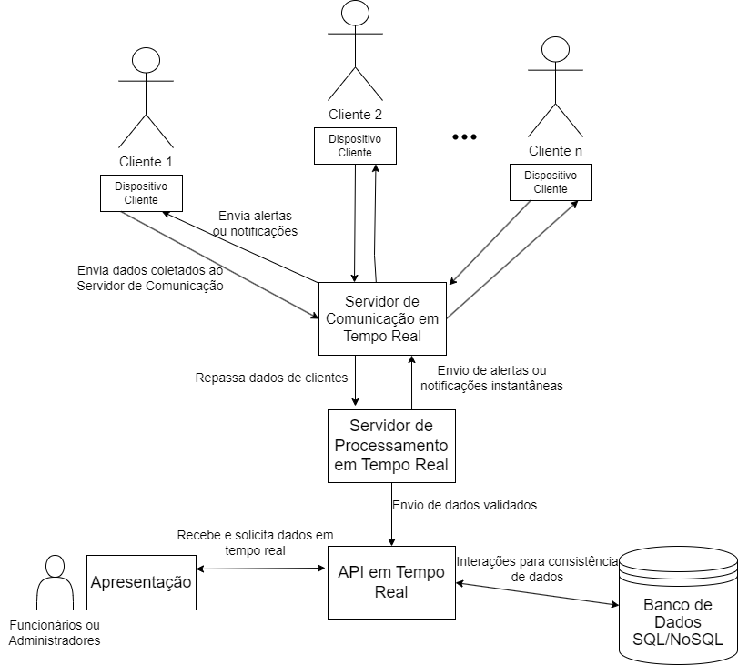

# my-vue-app

## Setup do projeto

### Instalar o node.js
```
sudo apt-get install nodejs
```
### Instalar o vue-cli
```
npm install -g @vue/cli
```
### Instalar o chart:
```
npm install vue-chartjs chart.js
```

## Hora de praticar
### Siga os passos abaixo para plotar um gráfico usando o vue:
1°- Abra o replit no seu navegador: https://replit.com/

2°- No canto superior direito clique em 'Create Repl', busque por 'VueJs' e crie seu projeto

3°- Clique na aba 'Shell' ao lado da aba 'Console' e digite o comando: npm install vue-chartjs chart.js

4°- Crie um componente dentro da pasta 'components' com o nome de 'BarCharts.vue'

5°- Vá até o site vue-charts e copie o template 'BarChart.vue': https://vue-chartjs.org/guide/#creating-your-first-chart

6°- Cole o template copiado dentro do componente 'BarCharts.vue' que você criou

7°- Dentro do componente 'App.vue' dentro da tag 'script' adicione a importação do Barchat: import BarChart from './components/BarChart.vue'

8°- Apague as importações de 'Helloworld' e 'TheWelcome'. Apague também a tag 'header' e 'style'. Mantenha a tag 'template' apenas com a 'main' dentro

9°- Ainda dentro do 'App.vue' dentro da 'main' adicione: <BarChart* /> e apague <TheWelcome* /> (sem asterisco).

10°- Vá até a pasta 'assets' e delete o conteúdo do arquivo 'main.css'

11°- Agora é só clicar em 'run' e se divertir editando o gráfico modelo.

## Arquitetura do sistema
*SmartFit* é uma academia inteligente, que possui como proposta o monitoramento de dados corporais e fisiológicos de seus clientes, para que esta possa fornecê-los um atendimento personalizado com base em suas características, além da prevenção e prestação contra possíveis acidentes, como arritmia cardíaca ao ser exposto a exercício intenso.

Para tal, é necessário uma comunicação rápida e eficiente entre os componentes do sistema distribuído. Será implementada uma arquitetura de sistema **cliente-servidor multicamada**, visto que o sistema será composto de clientes responsáveis pela apresentação e envio de dados, servidores centrais para processamento e um servidor para armazenamento de dados persistentes.

Abaixo, será explorado cada componente do sistema, suas funções e relacionamentos:

### Camada Cliente
A Camada Cliente é responsável por coletar dados do cliente em tempo real. A coleta é feita através de um *Smartwatch*, dispositivo capaz de medir temperaturas e batimentos cardíacos. Após a coleta, os dados são enviados ao servidor de comunicação em tempo real, por meio de uma rede de baixa latência.

Esses dispositivos podem ainda gerar alertas aos clientes, caso seja detectado condições alarmantes.

### Camada de Comunicação em Tempo Real
A Camada de Comunicação em Tempo Real possui a função de providenciar interações rápidas entre o servidor de processamento e os clientes. Para isto, conta com tecnologias especializadas em comunicação eficiente e de baixa latência, como WebSockets.

WebSockets é uma tecnologia de comunicação bidirecional, que permite respostas a eventos sem que haja a necessidade de consulta a um servidor para obtê-la, sendo ideal para o sistema em questão, em que a agilidade de resposta é essencial para evitar o agravamento de acidentes.

### Camada de Processamento em Tempo Real
A Camada de Processamento em Tempo Real é composta de um servidor de processamento, que recebe os dados dos clientes (intermediados pelo servidor de comunicação) e realiza análise em tempo real dos dados, faz a validação, e identifica riscos e padrões.

Após o processamento, os dados são encaminhados para o servidor de aplicação (API em Tempo Real) e, caso seja detectado algum dado preocupante, o servidor pode enviar alertas ou notificações instantâneas para o servidor de comunicação.

### Camada de Lógica de Aplicação (API em Tempo Real)
A Interface de Programação de Aplicações (API) em tempo real age como intermediadora entre o servidor de processamento, o servidor de dados persistentes, e a interface de usuário. Esta camada recebe os dados processados e interage com o servidor de banco de dados para manter a consistência, envolvendo operações como inserção, leitura, atualização e exclusão de dados no banco.

A camada da API ainda fornece uma interface para requisições da camada de apresentação, incluindo solicitações de recuperação de dados específicos, atualizações em tempo real e outras operações relacionadas à interface do usuário.

### Camada de Banco de Dados
A Camada de Banco de Dados é onde estão localizados os dados persistentes. Responsável por armazenar, recuperar e gerenciar os dados que são utilizados pelos sistema.

## Camada de Apresentação
Por fim, há a camada de apresentação, responsável por apresentar os dados coletados dos clientes aos administradores da academia, exibindo informações históricas e em tempo real, através de uma interface gráfica amigável, permitindo interações com o usuário e incentivando tomada de decisões.

Foi implementada uma demonstração utilizando o framework **Vue.js**, um framework reativo baseado em componentes, que permite atualizações automáticas na interface de usuário sempre que os dados subjacentes são modificados. Cada componente Vue é desenvolvido para representar uma parte específica da interface de usuário, esses componentes podem interagir com a camada de lógica de aplicação (API) por meio de chamadas de métodos ou eventos personalizados.

A interface dos admnistradores está representada abaixo:


## Esboço da Arquitetura
Segue a representação da arquitetura abaixo:


## Referências:

TANENBAUM, Andrew S. e Van Steen, Maarten. Sistemas Distribuídos: Princípios e Paradigmas. 2 ed. São Paulo: Prentice Hall,
2008.

The WebSocket API (WebSockets). Disponível em: <https://developer.mozilla.org/en-US/docs/Web/API/WebSockets_API>.

‌Vue.js. Disponível em: <https://vuejs.org>.